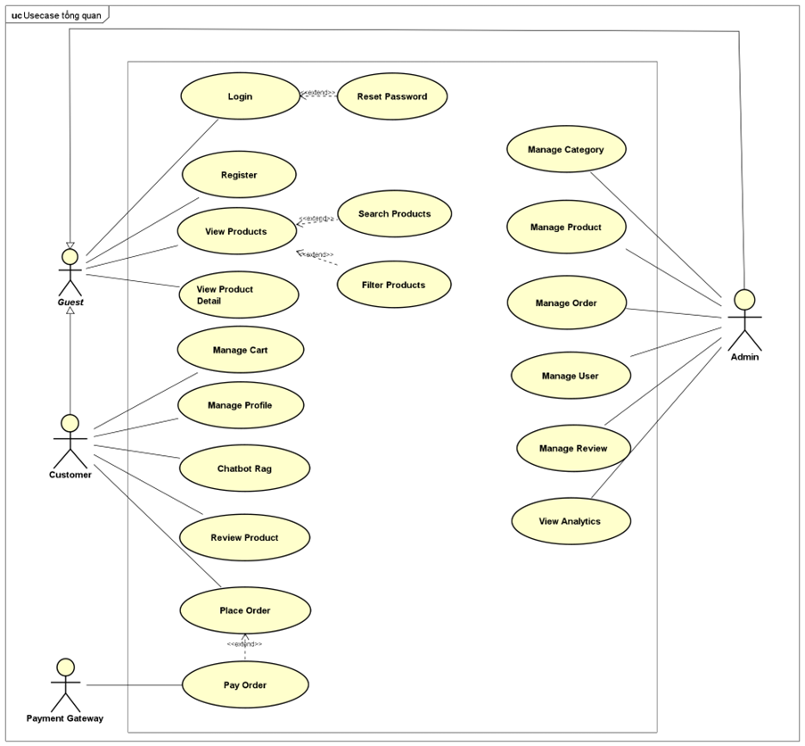
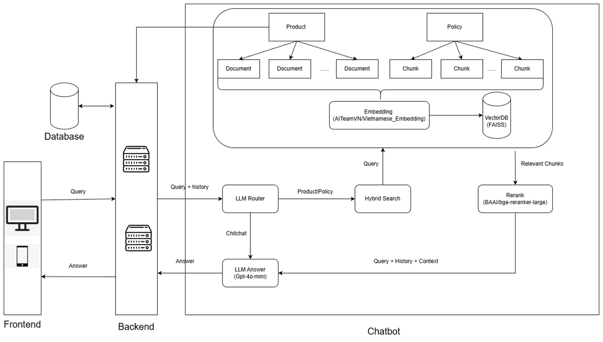
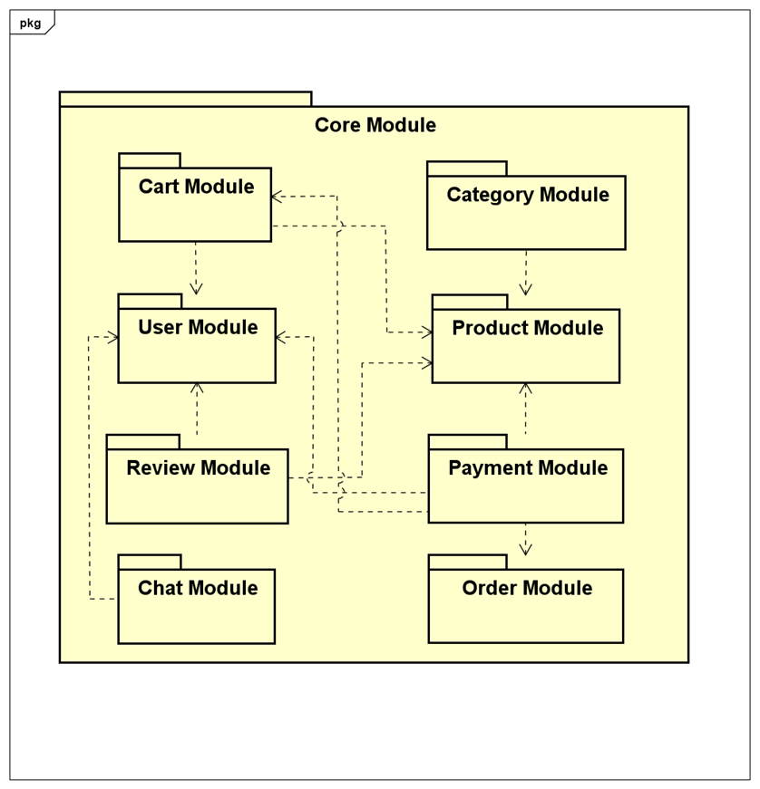
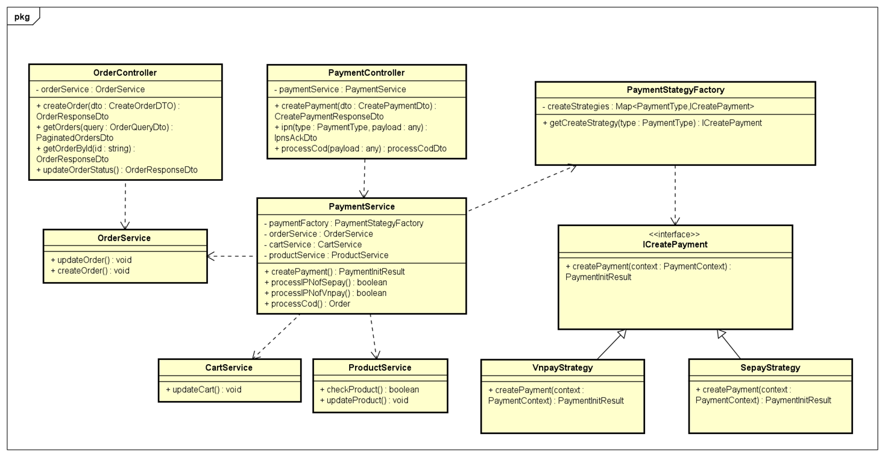
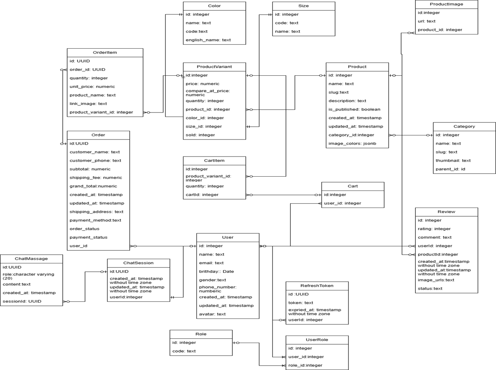

# Đồ án tốt nghiệp 2025.1
Xem demo tại: https://datn-2025-1-fe.vercel.app  

Tài khoản demo trang admin: https://datn-2025-1-fe.vercel.app/admin. Tài khoản: hiepma@gmail.com, mật khẩu: 123456

Xem mã nguồn backend tại: https://github.com/hiep957/DATN-2025.1-BE
## Các chức năng chính
<figure align="center">
  
  <figcaption><b>Hình 1.</b>Chức năng tổng quan của hệ thống</figcaption>
</figure>

## Giao diện website
<figure align="center">
  
</figure>
<figure align="center">
  
</figure>
<figure align="center">
  
</figure>
<figure align="center">
  
</figure>
<figure align="center">
  
</figure>
<figure align="center">
  
</figure>
<figure align="center">
  
</figure>
Quy trình nghiệp vụ mua hàng

<figure align="center">
  
  <figcaption><b>Hình 2.</b> Quy trình nghiệp vụ mua hàng</figcaption>
</figure>

## Kiến trúc hệ thống
<figure align="center">
  
  <figcaption><b>Hình 3.</b>Kiến trúc hệ thống </figcaption>
</figure>

Client được xây dựng framework Next.js. Có khả năng hiển thị giao diện, gửi yêu cầu đến Server qua HTTP, nhận phản hồi và render dữ liệu cho người dùng. 

Phía Server bao gồm 2 phần: Backend và Server

  Backend được xây dựng từ NestJS để tạo API cho website. Bên trong backend được chia thành các Module để thực hiện các chức năng riêng biệt như User, Product, Order, Payment,...Mỗi module bao gồm Controller, Service, Entity. Controller là nơi nhận request từ Client, kiểm tra quyền, dữ liệu đầu vào cơ bản (DTO/Validation), sau đó chuyển xử lý xuống Service. Service là nơi chứa logic nghiệp vụ chính. Entity là các lớp (class) đại diện cho các bảng trong cơ sở dữ liệu. Thay vì viết các câu lệnh SQL thủ công, hệ thống sử dụng kỹ thuật ORM ( Object-Relational Mapping) để ánh xạ các đối tượng trong code thành các bản ghi trong cơ sở dữ liệu và ngược lại. 

<figure align="center">
  
  <figcaption><b>Hình 4.</b>Kiến trúc Chatbot RAG </figcaption>
</figure>

<h3 align="center">Sơ đồ các module ở backend</h3>

  

Sơ đồ class quá trình thanh toán
<figure align="center">
  
</figure>

Sơ đồ CSDL
<figure align="center">
  
</figure>
